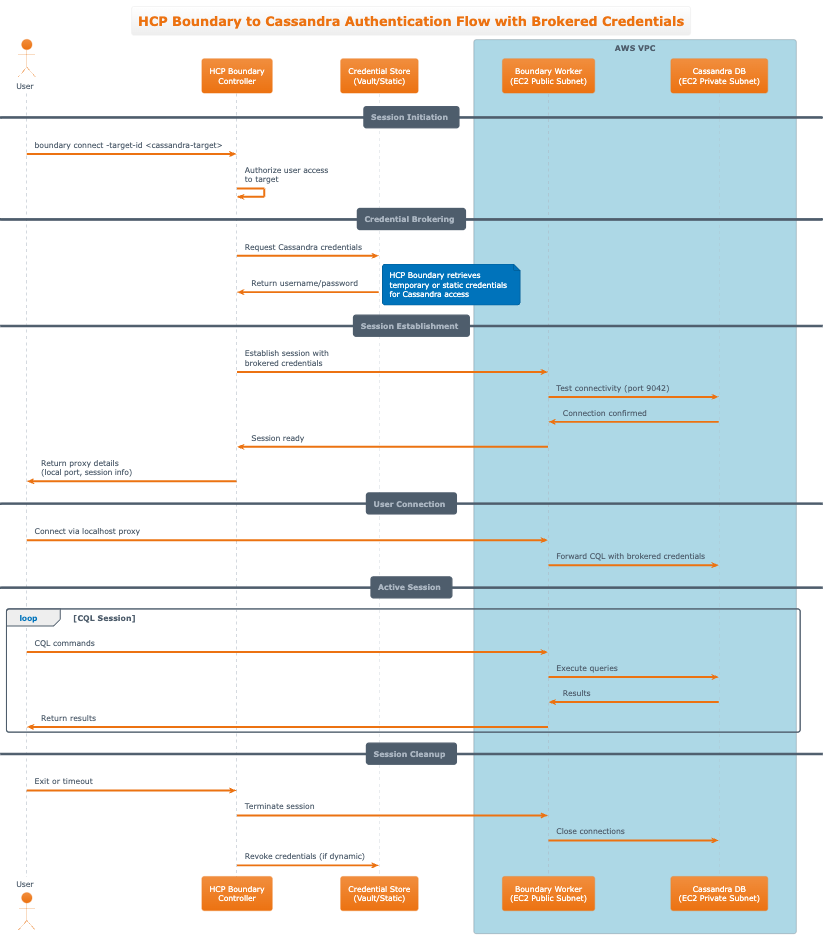

# Terraform Boundary and Cassandra Demo

> **⚠️ DEMO PURPOSE ONLY**  
> This project is designed for demonstration and educational purposes only. It is **NOT** intended for production use. The configuration includes security and architecture decisions that are suitable for learning and testing but should not be used in production environments without significant modifications and security hardening.
>
> **⚠️ CUSTOM USER DATA SCRIPTS**  
> This demo relies heavily on custom EC2 user data scripts that perform extensive software installation and configuration on startup. These scripts may become outdated over time as software versions, download URLs, and configuration requirements change. Regular maintenance and updates may be required to keep the demo functional.

This Terraform demo creates a complete infrastructure setup with two EC2 instances:

1. **Boundary Worker Instance** - Deployed in a public subnet, exposes port 9202 externally and registers with HCP Boundary
2. **Cassandra Database Instance** - Deployed in a private subnet, exposes port 9042 only to the Boundary worker

## Architecture

### Infrastructure Overview

```
Internet Gateway
       |
   Public Subnet (10.0.1.0/24)
       |
Boundary Worker (port 9202)
       |
   NAT Gateway
       |
  Private Subnet (10.0.2.0/24)
       |
Cassandra Database (port 9042)
```

### User Flow with Brokered Credentials

The following [diagram](./user-flow.puml) shows how users authenticate and connect to Cassandra through HCP Boundary with brokered credentials:

**High-level flow:**

1. User authenticates with HCP Boundary
2. User requests access to Cassandra target
3. HCP Boundary brokers credentials from credential store
4. Boundary worker establishes session with Cassandra
5. User connects via local proxy using brokered credentials
6. All CQL traffic is proxied through the boundary worker

## Prerequisites

1. **AWS Account** with appropriate permissions to create VPC, EC2, and networking resources
2. **AWS CLI** configured with valid credentials
3. **Terraform** version 1.0 or later
4. **HCP Boundary Cluster** with access to generate worker activation tokens
5. **AWS Key Pair** for SSH access to instances

## Quick Start

1. **Clone the repository**:

   ```bash
   git clone <repository-url>
   cd boundary-cassandra-terraform
   ```

2. **Copy and configure variables**:

   ```bash
   cp terraform.tfvars.example terraform.tfvars
   ```

3. **Generate a worker activation token** in your HCP Boundary console:

   - Navigate to your HCP Boundary cluster
   - Go to Workers section
   - Click "Generate Worker Token"
   - Copy the generated activation token

4. **Edit `terraform.tfvars`** with your specific values:

   ```hcl
   key_name                              = "your-aws-key-pair-name"
   boundary_hcp_cluster_id               = "19ac2c1a-e32b-448c-807e-5517a5f76366"
   controller_generated_activation_token = "your-controller-generated-activation-token"

   # Optional: Enable SSH access to Boundary worker (leave empty for no SSH access)
   # ssh_allowed_cidrs = ["YOUR.IP.ADDRESS/32"]
   ```

5. **Initialize and deploy**:

   ```bash
   terraform init
   terraform plan
   terraform apply
   ```

6. **Access your resources**:
   - Boundary worker will be accessible on port 9202
   - Cassandra will be accessible from the Boundary worker on port 9042

## Configuration

### Required Variables

| Variable                                | Description                                      |
| --------------------------------------- | ------------------------------------------------ |
| `key_name`                              | AWS Key Pair name for SSH access                 |
| `boundary_hcp_cluster_id`               | HCP Boundary cluster address                     |
| `controller_generated_activation_token` | Controller-generated activation token for worker |

### Optional Variables

| Variable                        | Default                 | Description                                                               |
| ------------------------------- | ----------------------- | ------------------------------------------------------------------------- |
| `vpc_id`                        | `""`                    | Existing VPC ID to use (leave empty to create new VPC)                    |
| `boundary_worker_instance_type` | `t3.small`              | Instance type for Boundary worker                                         |
| `boundary_version`              | `0.19.3`                | Version of Boundary Enterprise to install                                 |
| `cassandra_instance_type`       | `t3.small`              | Instance type for Cassandra                                               |
| `cassandra_cluster_name`        | `Cassandra EC2 Cluster` | Cassandra cluster name                                                    |
| `created_by`                    | `terraform`             | Who created the resources (used for tagging)                              |
| `vpc_cidr`                      | `10.0.0.0/16`           | VPC CIDR block (only used if creating new VPC)                            |
| `public_subnet_cidr`            | `10.0.1.0/24`           | Public subnet CIDR                                                        |
| `private_subnet_cidr`           | `10.0.2.0/24`           | Private subnet CIDR                                                       |
| `availability_zone`             | `""`                    | Specific AZ (auto-selected if empty)                                      |
| `ssh_allowed_cidrs`             | `[]`                    | CIDR blocks allowed SSH access to Boundary worker (empty = no SSH access) |
| `enable_internal_ssh`           | `false`                 | Enable SSH access to Cassandra from Boundary worker only                  |

## Outputs

After deployment, you'll receive outputs including:

- Boundary worker public and private IP addresses
- Boundary worker endpoint (IP:port)
- Cassandra private IP address
- Connection information and deployment summary
- Network resource IDs (VPC, subnets)

**Note**: Registration tokens and manual setup commands are no longer needed with controller-led activation.

## Cassandra Configuration

The Cassandra instance is automatically configured with:

- **Cluster Name**: As specified in variables (default: "Cassandra EC2 Cluster")
- **Authentication**: PasswordAuthenticator (enabled)
- **Authorization**: CassandraAuthorizer (enabled)
- **Network**: Listens on private IP, broadcast RPC on public IP
- **Seeds**: Uses its own private IP
- **Java**: OpenJDK 11
- **Version**: Apache Cassandra 5.0.4

## Boundary Worker Configuration

The Boundary worker is configured to:

- Listen on port 9202 for proxy connections
- Automatically register with your HCP Boundary cluster using controller-led activation
- Use the controller-generated activation token for secure registration
- Run as a systemd service for reliability
- Automatically start and connect without manual intervention
- Install Boundary Enterprise with configurable version (default: 0.19.3)

### Worker Activation Process

The worker uses **controller-led activation**, which means:

1. You generate an activation token in the HCP Boundary console
2. The token is provided to the worker via Terraform variables
3. The worker uses this token to automatically register with the controller
4. No manual registration steps or token retrieval required

### Boundary Version Configuration

The module allows you to specify which version of Boundary Enterprise to install:

```hcl
boundary_version = "0.19.3"  # Default version
```

This ensures consistency across deployments and allows you to control when to upgrade Boundary. The version must be a valid Boundary Enterprise release available from HashiCorp's releases.

### Checking Boundary Worker Status

SSH to the Boundary worker and run:

```bash
# Check service status
sudo systemctl status boundary-worker

# View logs
sudo journalctl -u boundary-worker -f

# View worker configuration
sudo cat /etc/boundary.d/boundary-worker.hcl
```

## Security

- Cassandra is in a private subnet with no direct internet access
- Only the Boundary worker can access Cassandra on port 9042
- Security groups enforce strict access controls
- SSH access to Boundary worker is configurable and disabled by default

### SSH Access Configuration

#### Boundary Worker SSH Access

By default, **no SSH access** is allowed to the Boundary worker for maximum security. You can enable SSH access by specifying allowed CIDR blocks:

```hcl
# Example: Allow SSH from specific IP addresses
ssh_allowed_cidrs = ["192.168.1.0/24", "10.0.0.0/8"]

# Example: Allow SSH from your current IP only
ssh_allowed_cidrs = ["YOUR.IP.ADDRESS/32"]

# Default: No SSH access (recommended for production)
ssh_allowed_cidrs = []  # or omit the variable entirely
```

**Security considerations for Boundary worker SSH:**

- Only specify trusted IP ranges or specific IP addresses
- Consider using a VPN or bastion host instead of direct SSH access
- If SSH access is needed, restrict to the minimum required IP ranges
- Use strong SSH key authentication

#### Internal SSH Access to Cassandra

Cassandra instances have no SSH access by default. However, you can enable SSH access from the Boundary worker network only by setting:

```hcl
enable_internal_ssh = true
```

When enabled, this creates a security group rule that allows SSH (port 22) access to Cassandra instances only from the Boundary worker security group. This provides a secure way to access Cassandra for troubleshooting while maintaining network isolation, as the SSH access is limited to the internal network and doesn't expose Cassandra to the public internet.

**Use cases for internal SSH to Cassandra:**

- Troubleshooting Cassandra configuration issues
- Monitoring system performance
- Log analysis and debugging
- Database maintenance tasks

**Security considerations for Cassandra SSH:**

- SSH access is restricted to the Boundary worker network only
- No direct internet access to Cassandra SSH
- Requires SSH key authentication
- Should only be enabled when needed for maintenance

## Troubleshooting

### Boundary Worker Issues

1. **Check service status**: `sudo systemctl status boundary-worker`
2. **View logs**: `sudo journalctl -u boundary-worker -f`
3. **Verify configuration**: `sudo cat /etc/boundary.d/boundary-worker.hcl`
4. **Check activation token**: Ensure the token is valid and not expired
5. **Verify cluster connectivity**: Ensure the worker can reach the HCP Boundary cluster
6. **Check setup logs**: `cat /tmp/boundary-setup.log` to see detailed setup information including tag processing

### Worker Tags Issues

If worker tags are not appearing correctly in Boundary:

1. **Check setup log**: `cat /tmp/boundary-setup.log` to see how tags were processed
2. **Verify JSON format**: Ensure your `worker_tags` variable is properly formatted in Terraform
3. **Check worker configuration**: `sudo cat /etc/boundary.d/boundary-worker.hcl` to see final tag configuration
4. **Restart worker**: If tags were fixed, restart with `sudo systemctl restart boundary-worker`

Example of properly formatted worker tags in `terraform.tfvars`:

```hcl
# This is handled automatically by the module, but shown for reference
worker_tags = {
  type        = ["worker", "linux", "ec2", "managed", "cassandra-access", "upstream"]
  environment = ["production"]
}
```

### Cassandra Issues

1. **Check service status**: `sudo systemctl status cassandra`
2. **View logs**: `sudo journalctl -u cassandra -f`
3. **Check node status**: `sudo -u cassandra /opt/cassandra/bin/nodetool status`
4. **Test connectivity**: From Boundary worker, use `ssh <cassandra-ip> 9042`
5. **SSH access**: If `enable_internal_ssh = true`, you can SSH from the Boundary worker to Cassandra for troubleshooting

### Network Issues

1. **Verify security groups**: Check AWS console for proper security group rules
2. **Check routing**: Ensure NAT gateway is working for private subnet internet access
3. **Test connectivity**: Use `ping` and `nc` from appropriate instances

## Cleanup

To destroy all resources:

```bash
terraform destroy
```

**Warning**: This will permanently delete all infrastructure created by this module.

## Terraform Structure

```
.
├── main.tf                     # Main configuration
├── variables.tf                # Input variables
├── outputs.tf                  # Output values
├── versions.tf                 # Provider requirements
├── terraform.tfvars.example    # Example variables file
├── README.md                   # This file
└── modules/
    ├── networking/             # VPC, subnets, security groups
    │   ├── main.tf
    │   ├── variables.tf
    │   └── outputs.tf
    ├── boundary-worker/        # Boundary worker instance
    │   ├── main.tf
    │   ├── variables.tf
    │   ├── outputs.tf
    │   └── user-data.sh
    └── cassandra/              # Cassandra instance
        ├── main.tf
        ├── variables.tf
        ├── outputs.tf
        └── user-data.sh
```
